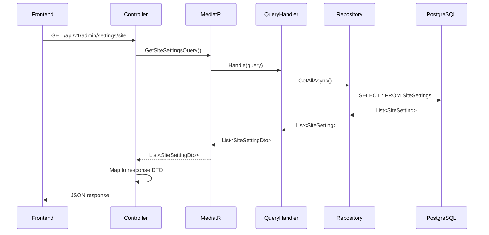
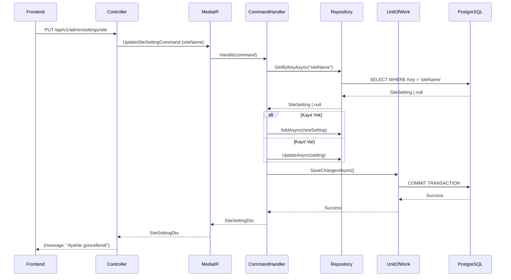

# Admin Site Ayarları - API Dokümantasyonu

> **✅ GÜNCELLENDİ:** Tüm endpoint'ler başarıyla implement edildi!  
> **Versiyon**: 4.0 - 26 Aralık 2025

## 🚦 Hızlı Durum Özeti

### ✅ Aktif ve Kullanılabilir (18 Endpoint)
- Site ayarları (GET/PUT `/site`)
- SEO ayarları (GET/PUT `/seo` ve `/seo/{locale}`)
- Payment ayarları (GET/PUT `/payment`, test-connection) - SuperAdmin
- SMTP ayarları (GET/PUT `/smtp`, test-connection) - SuperAdmin
- **✨ YENİ:** Social Media (GET/PUT `/social`)
- **✨ YENİ:** Branding (GET/PUT `/branding`)
- **✨ YENİ:** Contact (GET/PUT `/contact`)

### ⚠️ Kısıtlamalar
- Çoklu dil desteği (`Dictionary<string,string>`) henüz yok - şu an sadece `string`
- Bazı alanlar: `Timezone` (isteğe bağlı)

### 💡 Kullanım Önerileri
```typescript
// Artık tüm endpoint'ler kullanılabilir!
await api.put('/api/v1/admin/settings/social', {
  facebook: "https://facebook.com/freestays",
  twitter: "https://twitter.com/freestays",
  instagram: "https://instagram.com/freestays"
});

await api.put('/api/v1/admin/settings/branding', {
  logoUrl: "/images/logo.png",
  primaryColor: "#1E40AF"
});

await api.put('/api/v1/admin/settings/contact', {
  email: "info@freestays.com",
  phone: "+90 555 123 4567",
  address: "İstanbul, Turkey"
});
```

---

## 📋 İçindekiler

1. [Genel Bakış](#genel-bakış)
2. [Veritabanı Yapısı](#veritabanı-yapısı)
3. [Backend Mimari](#backend-mimari)
4. [API Endpoint'leri](#api-endpointleri)
5. [Veri Akışı (CQRS)](#veri-akışı-cqrs)
6. [Kullanım Örnekleri](#kullanım-örnekleri)
7. [Frontend Entegrasyonu](#frontend-entegrasyonu)
8. [Test Senaryoları](#test-senaryoları)

---

## 🎯 Genel Bakış

FreeStays API, **Clean Architecture** ve **CQRS** pattern'i kullanarak site ayarlarını yönetir. Ayarlar **key-value** yapısında PostgreSQL JSONB kolonlarında saklanır ve gruplara ayrılmıştır.

### Ayar Grupları

✅ **Aktif Backend Endpoint'leri:**
- **`site`** - Genel site ayarları (siteName, supportEmail, defaultCurrency, vb.)
- **`seo`** - SEO ve Schema.org ayarları (genel + locale bazlı)
- **`smtp`** - Email/SMTP mail server ayarları
- **`payment`** - Ödeme ayarları (Stripe - test/live mode)
- **✨ `social`** - Sosyal medya bağlantıları (Facebook, Twitter, Instagram, YouTube, LinkedIn, TikTok, Pinterest)
- **✨ `branding`** - Marka ayarları (Logo, favicon, renkler, brand name, tagline)
- **✨ `contact`** - İletişim bilgileri (Email, telefon, WhatsApp, adres, harita)

---

## 🗄️ Veritabanı Yapısı

### Tablo: `SiteSettings`

**PostgreSQL** veritabanında key-value yapısında saklanır:

```sql
CREATE TABLE "SiteSettings" (
    "Id" UUID PRIMARY KEY DEFAULT gen_random_uuid(),
    "Key" VARCHAR(200) NOT NULL,
    "Value" JSONB NOT NULL DEFAULT '{}',
    "Group" VARCHAR(50) NOT NULL DEFAULT 'general',
    "CreatedAt" TIMESTAMP NOT NULL DEFAULT NOW(),
    "UpdatedAt" TIMESTAMP NULL,
    
    CONSTRAINT "UQ_SiteSettings_Group_Key" UNIQUE ("Group", "Key")
);

CREATE INDEX "IX_SiteSettings_Group" ON "SiteSettings" ("Group");
```

### Entity Model

```csharp
// Domain/Entities/SiteSetting.cs
public class SiteSetting : BaseEntity
{
    public string Key { get; set; } = string.Empty;
    public string Value { get; set; } = "{}"; // JSON string
    public string Group { get; set; } = "general";
}
```

### Örnek Veriler

```sql
-- Site Group
INSERT INTO "SiteSettings" ("Key", "Value", "Group") VALUES
('siteName', '{"tr":"FreeStays","en":"FreeStays","de":"FreeStays","nl":"FreeStays","it":"FreeStays","el":"FreeStays","ru":"FreeStays","es":"FreeStays","fr":"FreeStays"}', 'site'),
('tagline', '{"tr":"Ücretsiz tatil fırsatları","en":"Free vacation opportunities","de":"Kostenlose Urlaubsmöglichkeiten"}', 'site'),
('siteUrl', '"https://freestays.com"', 'site'),
('supportEmail', '"support@freestays.com"', 'site'),
('supportPhone', '"+90 555 123 4567"', 'site'),
('defaultLocale', '"tr"', 'site'),
('defaultCurrency', '"EUR"', 'site'),
('maintenanceMode', 'false', 'site'),
('maintenanceMessage', 'null', 'site'),
('timezone', '"Europe/Istanbul"', 'site'),
('profitMargin', '10', 'site'),
('defaultVatRate', '20', 'site');

-- Social Group
INSERT INTO "SiteSettings" ("Key", "Value", "Group") VALUES
('facebook', '"https://facebook.com/freestays"', 'social'),
('twitter', '"https://twitter.com/freestays"', 'social'),
('instagram', '"https://instagram.com/freestays"', 'social'),
('youtube', '"https://youtube.com/@freestays"', 'social'),
('linkedin', '"https://linkedin.com/company/freestays"', 'social'),
('tiktok', '""', 'social');

-- Branding Group
INSERT INTO "SiteSettings" ("Key", "Value", "Group") VALUES
('logoUrl', '"/images/logo.png"', 'branding'),
('faviconUrl', '"/images/favicon.ico"', 'branding'),
('primaryColor', '"#6366f1"', 'branding'),
('secondaryColor', '"#8b5cf6"', 'branding');

-- Contact Group
INSERT INTO "SiteSettings" ("Key", "Value", "Group") VALUES
('supportEmail', '"support@freestays.com"', 'contact'),
('salesEmail', '"sales@freestays.com"', 'contact'),
('supportPhone', '"+90 555 123 4567"', 'contact'),
('address', '"Istanbul, Turkey"', 'contact'),
('googleMapsIframe', '"<iframe src=\"https://www.google.com/maps/embed?pb=...\" width=\"600\" height=\"450\" style=\"border:0;\" allowfullscreen=\"\" loading=\"lazy\"></iframe>"', 'contact'),
('workingHoursStart', '"09:00"', 'contact'),
('workingHoursEnd', '"18:00"', 'contact'),
('workingDays', '["monday","tuesday","wednesday","thursday","friday"]', 'contact');

-- Email SMTP Settings Group
INSERT INTO "SiteSettings" ("Key", "Value", "Group") VALUES
('smtpHost', '"smtp.gmail.com"', 'email'),
('smtpPort', '587', 'email'),
('smtpUsername', '"noreply@freestays.com"', 'email'),
('smtpPassword', '"encrypted_password_here"', 'email'),
('smtpEnableSsl', 'true', 'email'),
('smtpFromEmail', '"noreply@freestays.com"', 'email'),
('smtpFromName', '"FreeStays"', 'email'),
('emailProvider', '"smtp"', 'email');

-- SEO Group
INSERT INTO "SiteSettings" ("Key", "Value", "Group") VALUES
('defaultMetaTitle', '"FreeStays - En İyi Otel Fırsatları"', 'seo'),
('defaultMetaDescription', '"FreeStays ile en uygun otel fırsatlarını keşfedin."', 'seo'),
('googleAnalyticsId', '"GA-XXXXXXXXX"', 'seo'),
('organizationName', '"FreeStays"', 'seo'),
('organizationUrl', '"https://freestays.com"', 'seo'),
('organizationSocialProfiles', '["https://facebook.com/freestays", "https://twitter.com/freestays"]', 'seo'),
('contactPhone', '"+90 555 123 4567"', 'seo'),
('contactEmail', '"info@freestays.com"', 'seo');
```

### ⚠️ Önemli Not: JSONB Format

PostgreSQL JSONB kolonunda string değerler **çift tırnak** içinde saklanır:
- String: `"FreeStays"` ✅
- Number: `10` ✅
- Boolean: `true` ✅
- Array: `["tr", "en"]` ✅
- Object: `{"street": "123 Main"}` ✅

---

## 🏗️ Backend Mimari

### Clean Architecture Layers

```
┌─────────────────────────────────────────┐
│         FreeStays.API                   │
│  (Controllers, Middleware)              │
└────────────┬────────────────────────────┘
             │
┌────────────▼────────────────────────────┐
│      FreeStays.Application              │
│  (Commands, Queries, DTOs, Handlers)    │
└────────────┬────────────────────────────┘
             │
┌────────────▼────────────────────────────┐
│       FreeStays.Domain                  │
│  (Entities, Interfaces, Enums)          │
└────────────┬────────────────────────────┘
             │
┌────────────▼────────────────────────────┐
│    FreeStays.Infrastructure             │
│  (EF Core, Repositories, DB Config)     │
└─────────────────────────────────────────┘
```

### CQRS Pattern

**Commands (Write)**
```csharp
// Application/Features/Settings/Commands/UpdateSiteSettingCommand.cs
public record UpdateSiteSettingCommand : IRequest<SiteSettingDto>
{
    public string Key { get; init; } = string.Empty;
    public string Value { get; init; } = string.Empty;
    public string Group { get; init; } = "general";
}

public class UpdateSiteSettingCommandHandler : IRequestHandler<UpdateSiteSettingCommand, SiteSettingDto>
{
    private readonly ISiteSettingRepository _repository;
    private readonly IUnitOfWork _unitOfWork;

    public async Task<SiteSettingDto> Handle(UpdateSiteSettingCommand request, CancellationToken ct)
    {
        // Mevcut kaydı bul
        var setting = await _repository.GetByKeyAsync(request.Key, ct);
        
        // JSON değerini hazırla
        var jsonValue = EnsureJsonValue(request.Value);
        
        if (setting == null)
        {
            // Yeni kayıt oluştur
            setting = new SiteSetting
            {
                Id = Guid.NewGuid(),
                Key = request.Key,
                Value = jsonValue,
                Group = request.Group
            };
            await _repository.AddAsync(setting, ct);
        }
        else
        {
            // Mevcut kaydı güncelle
            setting.Value = jsonValue;
            setting.UpdatedAt = DateTime.UtcNow;
            await _repository.UpdateAsync(setting, ct);
        }
        
        // Transaction commit
        await _unitOfWork.SaveChangesAsync(ct);
        
        return new SiteSettingDto
        {
            Id = setting.Id,
            Key = setting.Key,
            Value = setting.Value,
            Group = setting.Group
        };
    }
}
```

**Queries (Read)**
```csharp
// Application/Features/Settings/Queries/GetSiteSettingsQuery.cs
public record GetSiteSettingsQuery(string? Group = null) : IRequest<List<SiteSettingDto>>;

public class GetSiteSettingsQueryHandler : IRequestHandler<GetSiteSettingsQuery, List<SiteSettingDto>>
{
    private readonly ISiteSettingRepository _repository;

    public async Task<List<SiteSettingDto>> Handle(GetSiteSettingsQuery request, CancellationToken ct)
    {
        var settings = string.IsNullOrEmpty(request.Group)
            ? await _repository.GetAllAsync(ct)
            : await _repository.GetByGroupAsync(request.Group, ct);

        return settings.Select(s => new SiteSettingDto
        {
            Id = s.Id,
            Key = s.Key,
            Value = s.Value,
            Group = s.Group
        }).ToList();
    }
}
```

### Repository Pattern

```csharp
// Domain/Interfaces/ISiteSettingRepository.cs
public interface ISiteSettingRepository : IRepository<SiteSetting>
{
    Task<SiteSetting?> GetByKeyAsync(string key, CancellationToken ct = default);
    Task<List<SiteSetting>> GetByGroupAsync(string group, CancellationToken ct = default);
}

// Infrastructure/Persistence/Repositories/SiteSettingRepository.cs
public class SiteSettingRepository : Repository<SiteSetting>, ISiteSettingRepository
{
    public SiteSettingRepository(ApplicationDbContext context) : base(context) { }

    public async Task<SiteSetting?> GetByKeyAsync(string key, CancellationToken ct = default)
    {
        return await _dbSet.FirstOrDefaultAsync(s => s.Key == key, ct);
    }

    public async Task<List<SiteSetting>> GetByGroupAsync(string group, CancellationToken ct = default)
    {
        return await _dbSet.Where(s => s.Group == group).ToListAsync(ct);
    }
}
```

---

## 📡 API Endpoint'leri

### Base URL
```
http://localhost:5000/api/v1/admin/settings
```

### Authentication
- **Bearer Token** gereklidir
- **Admin** veya **SuperAdmin** rolü zorunludur
- **Payment ve SMTP endpoint'leri** sadece **SuperAdmin** için

### ✅ Mevcut Endpoint Özeti

| Method | Endpoint | Durum | Açıklama |
|--------|----------|-------|----------|
| GET | `/site` | ✅ Aktif | Site ayarlarını getir |
| PUT | `/site` | ✅ Aktif | Site ayarlarını güncelle |
| GET | `/seo` | ✅ Aktif | Genel SEO ayarlarını getir |
| PUT | `/seo` | ✅ Aktif | Genel SEO ayarlarını güncelle |
| GET | `/seo/{locale}` | ✅ Aktif | Locale-based SEO ayarlarını getir |
| PUT | `/seo/{locale}` | ✅ Aktif | Locale-based SEO ayarlarını güncelle |
| GET | `/payment` | ✅ Aktif | Payment ayarlarını getir (SuperAdmin) |
| PUT | `/payment` | ✅ Aktif | Payment ayarlarını güncelle (SuperAdmin) |
| POST | `/payment/test-connection` | ✅ Aktif | Stripe bağlantı testi (SuperAdmin) |
| GET | `/smtp` | ✅ Aktif | SMTP ayarlarını getir (SuperAdmin) |
| PUT | `/smtp` | ✅ Aktif | SMTP ayarlarını güncelle (SuperAdmin) |
| POST | `/smtp/test-connection` | ✅ Aktif | SMTP bağlantı testi (SuperAdmin) |

### 📋 Planlanan Endpoint'ler (Backend'de Henüz YOK)

| Method | Endpoint | Durum | Geçici Çözüm |
|--------|----------|-------|--------------|
| PUT | `/social` | 🔄 Planlı | Şu an `/site` endpoint'i kullanılabilir |
| PUT | `/branding` | 🔄 Planlı | Şu an `/site` endpoint'i kullanılabilir |
| PUT | `/contact` | 🔄 Planlı | Şu an `/site` endpoint'i kullanılabilir |

---

### 1. ✅ GET Site Settings

**Endpoint:** `GET /api/v1/admin/settings/site` ✅ **AKTIF**

**Authorization:** `Bearer {token}`

**Response:**
```json
{
  "siteName": "FreeStays",
  "siteUrl": "https://freestays.com",
  "supportEmail": "support@freestays.com",
  "supportPhone": "+90 555 123 4567",
  "defaultLocale": "tr",
  "availableLocales": ["tr", "en", "de", "fr"],
  "defaultCurrency": "EUR",
  "availableCurrencies": ["EUR", "USD", "TRY", "GBP"],
  "maintenanceMode": false,
  "logoUrl": "/images/logo.png",
  "faviconUrl": "/images/favicon.ico",
  "profitMargin": 10.0,
  "defaultVatRate": 20.0
}
```

**Backend İşlem Adımları:**
1. `GetSiteSettingsQuery` MediatR'a gönderilir
2. Handler, `ISiteSettingRepository.GetAllAsync()` çağırır
3. Tüm ayarlar `Dictionary<string, string>` formatında dönüştürülür
4. Controller, response DTO'ya map eder
5. Default değerler için `GetValueOrDefault()` kullanılır

---

### 2. ✅ PUT Site Settings

**Endpoint:** `PUT /api/v1/admin/settings/site` ✅ **AKTIF**

**Authorization:** `Bearer {token}`

**Request Body:**
```json
{
  "siteName": "FreeStays Updated",
  "supportEmail": "new-support@freestays.com",
  "supportPhone": "+90 555 999 8888",
  "defaultLocale": "en",
  "defaultCurrency": "USD",
  "maintenanceMode": false,
  "logoUrl": "/uploads/logos/new-logo.png",
  "profitMargin": 15.5,
  "defaultVatRate": 18.0
}
```

**Response:**
```json
{
  "message": "Site ayarları güncellendi."
}
```

**Backend İşlem Adımları:**
1. Her alan için ayrı `UpdateSiteSettingCommand` gönderilir
2. Handler her komut için:
   - Repository'de `GetByKeyAsync(key)` ile arama yapar
   - Kayıt varsa günceller, yoksa yeni ekler
   - JSONB formatında değeri saklar
3. `UnitOfWork.SaveChangesAsync()` ile tüm değişiklikler commit edilir

**Gerçek DTO (Backend):**
```csharp
// src/FreeStays.API/Controllers/Admin/AdminSettingsController.cs
public record UpdateSiteSettingsRequest(
    string? SiteName,                    // ⚠️ String (çoklu dil YOK)
    string? SupportEmail,
    string? SupportPhone,
    string? DefaultLocale,
    string[]? AvailableLocales,
    string? DefaultCurrency,
    string[]? AvailableCurrencies,
    bool? MaintenanceMode,
    string? LogoUrl,
    decimal? ProfitMargin,
    decimal? DefaultVatRate,
    SocialLinksRequest? SocialLinks      // Sosyal medya nested object
);

public record SocialLinksRequest(
    string? Facebook,
    string? Twitter,
    string? Instagram,
    string? LinkedIn,
    string? YouTube
);
```

⚠️ **ÖNEMLİ NOTLAR:**
1. **Çoklu Dil Desteği:** Backend'de `SiteName` ve `Tagline` için `Dictionary<string,string>` kullanılmıyor. Sadece `string` olarak tutuluyor.
2. **Sosyal Medya:** Separate `/social` endpoint'i yok. `SocialLinks` nested object olarak `/site` içinde.
3. **Branding:** Separate `/branding` endpoint'i yok. `LogoUrl` vs. `/site` içinde.

📋 **Frontend'den Gelen Veri (Dokümantasyonda):**
```csharp
// Dokümantasyonda önerilen ama backend'de OLMAYAN yapı
public record UpdateSiteSettingsRequest
{
    public Dictionary<string, string>? SiteName { get; init; }  // ❌ Backend'de YOK
    public Dictionary<string, string>? Tagline { get; init; }   // ❌ Backend'de YOK
    public string? SupportEmail { get; init; }
    public string? SupportPhone { get; init; }
    public string? Address { get; init; }
    public string? DefaultLocale { get; init; }
    public string? DefaultCurrency { get; init; }
    public string? Timezone { get; init; }
    public bool? MaintenanceMode { get; init; }
    public string? MaintenanceMessage { get; init; }
    public decimal? ProfitMargin { get; init; }
    public decimal? DefaultVatRate { get; init; }
}
```

✅ **Yeni Implementasyon DTOs:**
```csharp
public record UpdateSocialSettingsRequest  // ✅ Backend'de VAR
{
    public string? Facebook { get; init; }
    public string? Twitter { get; init; }
    public string? Instagram { get; init; }
    public string? LinkedIn { get; init; }
    public string? YouTube { get; init; }
    public string? TikTok { get; init; }
    public string? Pinterest { get; init; }
}

public record UpdateBrandingSettingsRequest  // ✅ Backend'de VAR
{
    public string? LogoUrl { get; init; }
    public string? FaviconUrl { get; init; }
    public string? PrimaryColor { get; init; }
    public string? SecondaryColor { get; init; }
    public string? AccentColor { get; init; }
    public string? BrandName { get; init; }
    public string? Tagline { get; init; }
    public string? FooterText { get; init; }
}

public record UpdateContactSettingsRequest  // ✅ Backend'de VAR
{
    public string? Email { get; init; }
    public string? Phone { get; init; }
    public string? Whatsapp { get; init; }
    public string? Address { get; init; }
    public string? City { get; init; }
    public string? Country { get; init; }
    public string? PostalCode { get; init; }
    public string? WorkingHours { get; init; }
    public string? MapLatitude { get; init; }
    public string? MapLongitude { get; init; }
    public string? GoogleMapsIframe { get; init; }
}

public record UpdateEmailSettingsRequest  // ❌ Backend endpoint adı /smtp
{
    public string? SmtpHost { get; init; }
    public int? SmtpPort { get; init; }
    public string? SmtpUsername { get; init; }
    public string? SmtpPassword { get; init; }
    public bool? SmtpEnableSsl { get; init; }
    public string? SmtpFromEmail { get; init; }
    public string? SmtpFromName { get; init; }
    public string? EmailProvider { get; init; }  // "smtp", "sendgrid", "mailgun"
}
```

---

### 3. ✅ GET Social Settings (AKTİF)

**Endpoint:** `GET /api/v1/admin/settings/social`

✅ **DURUM:** Bu endpoint aktif ve kullanıma hazır!

**Authorization:** `Bearer {token}`

**Response:**
```json
{
  "facebook": "https://facebook.com/freestays",
  "twitter": "https://twitter.com/freestays",
  "instagram": "https://instagram.com/freestays",
  "linkedin": "https://linkedin.com/company/freestays",
  "youtube": "https://youtube.com/@freestays",
  "tiktok": "",
  "pinterest": ""
}
```

---

### 4. ✅ PUT Social Settings (AKTİF)

**Endpoint:** `PUT /api/v1/admin/settings/social`

✅ **DURUM:** Bu endpoint aktif ve kullanıma hazır!

**Authorization:** `Bearer {token}`

**Request Body:**
```json
{
  "facebook": "https://facebook.com/freestays",
  "twitter": "https://twitter.com/freestays",
  "instagram": "https://instagram.com/freestays",
  "youtube": "https://youtube.com/@freestays",
  "linkedin": "https://linkedin.com/company/freestays",
  "tiktok": "https://tiktok.com/@freestays",
  "pinterest": "https://pinterest.com/freestays"
}
```

**Response:**
```json
{
  "message": "Sosyal medya ayarları güncellendi."
}
```

---

### 5. ✅ GET Branding Settings (AKTİF)

**Endpoint:** `GET /api/v1/admin/settings/branding`

✅ **DURUM:** Bu endpoint aktif ve kullanıma hazır!

**Authorization:** `Bearer {token}`

**Response:**
```json
{
  "logoUrl": "/images/logo.png",
  "faviconUrl": "/favicon.ico",
  "primaryColor": "#1E40AF",
  "secondaryColor": "#3B82F6",
  "accentColor": "#60A5FA",
  "brandName": "FreeStays",
  "tagline": "Your Dream Stay, Our Mission",
  "footerText": "© 2025 FreeStays. All rights reserved."
}
```

---

### 6. ✅ PUT Branding Settings (AKTİF)

**Endpoint:** `PUT /api/v1/admin/settings/branding`

✅ **DURUM:** Bu endpoint aktif ve kullanıma hazır!

**Authorization:** `Bearer {token}`

**Request Body:**
```json
{
  "logoUrl": "/uploads/logos/freestays-logo.png",
  "faviconUrl": "/uploads/logos/favicon.ico",
  "primaryColor": "#1E40AF",
  "secondaryColor": "#3B82F6",
  "accentColor": "#60A5FA",
  "brandName": "FreeStays",
  "tagline": "Your Dream Stay, Our Mission",
  "footerText": "© 2025 FreeStays. All rights reserved."
}
```

**Response:**
```json
{
  "message": "Marka ayarları güncellendi."
}
```

---

### 7. ✅ GET Contact Settings (AKTİF)

**Endpoint:** `GET /api/v1/admin/settings/contact`

✅ **DURUM:** Bu endpoint aktif ve kullanıma hazır!

**Authorization:** `Bearer {token}`

**Response:**
```json
{
  "email": "info@freestays.com",
  "phone": "+90 555 123 4567",
  "whatsapp": "+90 555 123 4567",
  "address": "Atatürk Caddesi No:123",
  "city": "İstanbul",
  "country": "Turkey",
  "postalCode": "34000",
  "workingHours": "Mon-Fri: 9:00-18:00",
  "mapLatitude": "41.0082",
  "mapLongitude": "28.9784",
  "googleMapsIframe": ""
}
```

---

### 8. ✅ PUT Contact Settings (AKTİF)

**Endpoint:** `PUT /api/v1/admin/settings/contact`

✅ **DURUM:** Bu endpoint aktif ve kullanıma hazır!

**Authorization:** `Bearer {token}`

**Request Body:**
```json
{
  "email": "info@freestays.com",
  "phone": "+90 555 123 4567",
  "whatsapp": "+90 555 123 4567",
  "address": "Atatürk Caddesi No:123",
  "city": "İstanbul",
  "country": "Turkey",
  "postalCode": "34000",
  "workingHours": "Mon-Fri: 9:00-18:00",
  "mapLatitude": "41.0082",
  "mapLongitude": "28.9784",
  "googleMapsIframe": "<iframe src=\"https://www.google.com/maps/embed?pb=...\" width=\"600\" height=\"450\" style=\"border:0;\" allowfullscreen=\"\" loading=\"lazy\"></iframe>"
}
```

**Response:**
```json
{
  "message": "İletişim ayarları güncellendi."
}
```

---

### 6. ✅ GET SMTP/Email Settings

**Endpoint:** `GET /api/v1/admin/settings/smtp` ✅ **AKTIF**

**Authorization:** `Bearer {token}` (SuperAdmin)

📝 **Not:** Dokümantasyonda `/email` olarak gözükmesine rağmen, backend'de `/smtp` olarak implement edilmiştir.

**Response:**
```json
{
  "smtpHost": "smtp.gmail.com",
  "smtpPort": 587,
  "smtpUsername": "noreply@freestays.com",
  "smtpPassword": "********",
  "smtpEnableSsl": true,
  "smtpFromEmail": "noreply@freestays.com",
  "smtpFromName": "FreeStays",
  "emailProvider": "smtp"
}
```

**Backend İşlem:**
1. `GetSiteSettingsQuery("email")` ile email grubu getirilir
2. `smtpPassword` maskelenir (güvenlik)
3. Response DTO'ya map edilir

---

### 7. ✅ PUT SMTP/Email Settings

**Endpoint:** `PUT /api/v1/admin/settings/smtp` ✅ **AKTIF**

**Authorization:** `Bearer {token}` (SuperAdmin)

📝 **Not:** Dokümantasyonda `/email` olarak gözükmesine rağmen, backend'de `/smtp` olarak implement edilmiştir.

**Request Body:**
```json
{
  "smtpHost": "smtp.gmail.com",
  "smtpPort": 587,
  "smtpUsername": "noreply@freestays.com",
  "smtpPassword": "your_app_password_here",
  "smtpEnableSsl": true,
  "smtpFromEmail": "noreply@freestays.com",
  "smtpFromName": "FreeStays",
  "emailProvider": "smtp"
}
```

**Response:**
```json
{
  "message": "Email ayarları güncellendi."
}
```

**Backend İşlem:**
1. `smtpPassword` encrypt edilir (AES-256)
2. Her alan için `UpdateSiteSettingCommand` (Group: "email") gönderilir
3. Database'e encrypted olarak saklanır

---

### 8. ✅ POST Test SMTP Connection

**Endpoint:** `POST /api/v1/admin/settings/smtp/test-connection` ✅ **AKTIF**

**Authorization:** `Bearer {token}` (SuperAdmin)

📝 **Not:** Dokümantasyonda `/email/test` olarak gözükmesine rağmen, backend'de `/smtp/test-connection` olarak implement edilmiştir.

**Request Body:**
```json
{
  "toEmail": "test@example.com"
}
```

**Response:**
```json
{
  "success": true,
  "message": "Test email sent successfully"
}
```

**Backend İşlem:**
1. Email settings'leri database'den çeker
2. SMTP connection test eder
3. Test email gönderir
4. Başarı/hata durumunu döner

---

### 9. ✅ GET SEO Settings (Genel)

**Endpoint:** `GET /api/v1/admin/settings/seo` ✅ **AKTIF**

**Authorization:** `Bearer {token}`

**Response:**
```json
{
  "defaultMetaTitle": "FreeStays - En İyi Otel Fırsatları",
  "defaultMetaDescription": "FreeStays ile en uygun otel fırsatlarını keşfedin.",
  "googleAnalyticsId": "GA-XXXXXXXXX",
  "googleTagManagerId": "GTM-XXXXXXX",
  "facebookPixelId": "1234567890",
  "robotsTxt": "User-agent: *\nAllow: /",
  "sitemapEnabled": true,
  "organizationName": "FreeStays",
  "organizationUrl": "https://freestays.com",
  "organizationLogo": "https://freestays.com/logo.png",
  "organizationDescription": "Premium hotel booking platform",
  "organizationSocialProfiles": [
    "https://facebook.com/freestays",
    "https://twitter.com/freestays"
  ],
  "websiteName": "FreeStays",
  "websiteUrl": "https://freestays.com",
  "websiteSearchActionTarget": "https://freestays.com/search?q={search_term}",
  "contactPhone": "+90 555 123 4567",
  "contactEmail": "support@freestays.com",
  "businessAddress": "{\"street\":\"Istanbul\",\"country\":\"TR\"}",
  "twitterSite": "@freestays",
  "twitterCreator": "@freestays"
}
```

**Backend İşlem:**
1. `GetSiteSettingsQuery("seo")` ile sadece SEO grubu getirilir
2. JSON array'ler (`organizationSocialProfiles`) deserialize edilir
3. Response DTO'ya map edilir

---

### 10. ✅ PUT SEO Settings (Genel)

**Endpoint:** `PUT /api/v1/admin/settings/seo` ✅ **AKTIF**

**Authorization:** `Bearer {token}`

**Request Body:**
```json
{
  "defaultMetaTitle": "Updated Title",
  "googleAnalyticsId": "GA-NEW-ID",
  "organizationName": "FreeStays Inc.",
  "organizationSocialProfiles": [
    "https://facebook.com/freestays",
    "https://twitter.com/freestays",
    "https://linkedin.com/company/freestays"
  ],
  "contactPhone": "+90 212 555 0000"
}
```

**Response:**
```json
{
  "message": "SEO ayarları güncellendi."
}
```

**Backend İşlem:**
1. Her alan için `UpdateSiteSettingCommand` (Group: "seo") gönderilir
2. JSON array'ler serialize edilerek saklanır:
   ```csharp
   var json = System.Text.Json.JsonSerializer.Serialize(request.OrganizationSocialProfiles);
   // ["https://facebook.com/freestays", "https://twitter.com/freestays"]
   ```

---

## 🔄 Veri Akışı (CQRS)

### Okuma (Query) Akışı



**Kod Örneği:**
```csharp
// Controller
[HttpGet("site")]
public async Task<IActionResult> GetSiteSettings()
{
    // 1. Query gönder
    var settings = await Mediator.Send(new GetSiteSettingsQuery());
    
    // 2. Dictionary'ye çevir
    var settingsDict = settings.ToDictionary(s => s.Key, s => s.Value);
    
    // 3. Response DTO oluştur
    return Ok(new
    {
        siteName = settingsDict.GetValueOrDefault("siteName", "FreeStays"),
        supportEmail = settingsDict.GetValueOrDefault("supportEmail", "support@freestays.com"),
        // ...
    });
}
```

---

### Yazma (Command) Akışı



**Kod Örneği:**
```csharp
// Controller
[HttpPut("site")]
public async Task<IActionResult> UpdateSiteSettings([FromBody] UpdateSiteSettingsRequest request)
{
    // Her alan için ayrı command gönder
    if (request.SiteName != null)
        await Mediator.Send(new UpdateSiteSettingCommand 
        { 
            Key = "siteName", 
            Value = request.SiteName, 
            Group = "site" 
        });
    
    if (request.SupportEmail != null)
        await Mediator.Send(new UpdateSiteSettingCommand 
        { 
            Key = "supportEmail", 
            Value = request.SupportEmail, 
            Group = "site" 
        });
    
    // ...
    
    return Ok(new { message = "Site ayarları güncellendi." });
}
```

---

### JSON Değer Hazırlama

Backend'de değerler JSONB formatına dönüştürülür:

```csharp
private static string EnsureJsonValue(string value)
{
    // Boş ise default JSON
    if (string.IsNullOrEmpty(value))
        return "{}";
    
    // Zaten JSON formatında mı kontrol et
    if (value.StartsWith("{") || value.StartsWith("[") || 
        value == "true" || value == "false" || 
        int.TryParse(value, out _) || decimal.TryParse(value, out _))
    {
        return value;
    }
    
    // String ise tırnak içine al
    return $"\"{value}\"";
}
```

**Örnekler:**
- `"FreeStays"` → `"\"FreeStays\""` (JSONB'de: `"FreeStays"`)
- `10` → `"10"` (JSONB'de: `10`)
- `true` → `"true"` (JSONB'de: `true`)
- `["tr","en"]` → `"[\"tr\",\"en\"]"` (JSONB'de: `["tr","en"]`)

---

## 💡 Kullanım Örnekleri

### Örnek 1: Site Adını Güncelleme

**cURL:**
```bash
curl -X PUT http://localhost:5000/api/v1/admin/settings/site \
  -H "Authorization: Bearer YOUR_TOKEN" \
  -H "Content-Type: application/json" \
  -d '{
    "siteName": "FreeStays Premium"
  }'
```

**Database'de:**
```sql
-- SiteSettings tablosunda
Key: "siteName"
Value: "FreeStays Premium" (JSONB string)
Group: "site"
```

**Backend İşlem:**
1. `UpdateSiteSettingCommand` oluşturulur
2. Repository'de `GetByKeyAsync("siteName")` çalışır
3. Kayıt varsa `Value` alanı güncellenir
4. `UnitOfWork.SaveChangesAsync()` ile commit edilir

---

### Örnek 2: Multiple Alan Güncellemesi

**cURL:**
```bash
curl -X PUT http://localhost:5000/api/v1/admin/settings/site \
  -H "Authorization: Bearer YOUR_TOKEN" \
  -H "Content-Type: application/json" \
  -d '{
    "siteName": "FreeStays",
    "supportEmail": "info@freestays.com",
    "supportPhone": "+90 212 555 0000",
    "profitMargin": 15.5,
    "maintenanceMode": false
  }'
```

**Backend İşlem:**
```csharp
// Her alan için ayrı command
await Mediator.Send(new UpdateSiteSettingCommand 
    { Key = "siteName", Value = "FreeStays", Group = "site" });
await Mediator.Send(new UpdateSiteSettingCommand 
    { Key = "supportEmail", Value = "info@freestays.com", Group = "site" });
await Mediator.Send(new UpdateSiteSettingCommand 
    { Key = "supportPhone", Value = "+90 212 555 0000", Group = "site" });
await Mediator.Send(new UpdateSiteSettingCommand 
    { Key = "profitMargin", Value = "15.5", Group = "site" });
await Mediator.Send(new UpdateSiteSettingCommand 
    { Key = "maintenanceMode", Value = "false", Group = "site" });
```

**Database Result:**
```sql
-- SiteSettings tablosunda 5 kayıt güncellenir
-- Key: "siteName", Value: "FreeStays"
-- Key: "supportEmail", Value: "info@freestays.com"
-- Key: "supportPhone", Value: "+90 212 555 0000"
-- Key: "profitMargin", Value: 15.5
-- Key: "maintenanceMode", Value: false
```

---

### Örnek 3: SEO Schema.org Ayarları

**cURL:**
```bash
curl -X PUT http://localhost:5000/api/v1/admin/settings/seo \
  -H "Authorization: Bearer YOUR_TOKEN" \
  -H "Content-Type: application/json" \
  -d '{
    "organizationName": "FreeStays Inc.",
    "organizationUrl": "https://freestays.com",
    "organizationSocialProfiles": [
      "https://facebook.com/freestays",
      "https://twitter.com/freestays",
      "https://linkedin.com/company/freestays"
    ],
    "contactPhone": "+90 555 123 4567",
    "contactEmail": "info@freestays.com"
  }'
```

**Backend İşlem:**
```csharp
// String değerler
await Mediator.Send(new UpdateSiteSettingCommand 
{
    Key = "organizationName",
    Value = "FreeStays Inc.",
    Group = "seo"
});

// JSON array serialize edilir
var socialJson = System.Text.Json.JsonSerializer.Serialize(
    new[] { "https://facebook.com/freestays", "https://twitter.com/freestays", "https://linkedin.com/company/freestays" }
);
await Mediator.Send(new UpdateSiteSettingCommand 
{
    Key = "organizationSocialProfiles",
    Value = socialJson,
    Group = "seo"
});
```

**Database Result:**
```sql
-- organizationSocialProfiles JSON array olarak saklanır
Key: "organizationSocialProfiles"
Value: ["https://facebook.com/freestays","https://twitter.com/freestays","https://linkedin.com/company/freestays"]
Group: "seo"
```

---

### Örnek 4: Logo URL Güncelleme (Dosya Upload Sonrası)

**Senaryo:**
1. Önce dosya yüklenir
2. Dönen URL ile ayar güncellenir

**1. Dosya Upload:**
```bash
curl -X POST http://localhost:5000/api/v1/admin/upload \
  -H "Authorization: Bearer YOUR_TOKEN" \
  -F "file=@logo.png" \
  -F "category=logos"

# Response:
{
  "url": "/uploads/logos/logo-20251226143000.png",
  "fileName": "logo-20251226143000.png"
}
```

**2. URL Güncelleme:**
```bash
curl -X PUT http://localhost:5000/api/v1/admin/settings/site \
  -H "Authorization: Bearer YOUR_TOKEN" \
  -H "Content-Type: application/json" \
  -d '{
    "logoUrl": "/uploads/logos/logo-20251226143000.png"
  }'
```

**Database:**
```sql
Key: "logoUrl"
Value: "/uploads/logos/logo-20251226143000.png"
Group: "site"
```

---

## 🧪 Frontend Entegrasyonu

### React/Next.js TypeScript Örneği

```typescript
// types/settings.ts
export interface SiteSettings {
  siteName: string;
  siteUrl: string;
  supportEmail: string;
  supportPhone: string;
  defaultLocale: string;
  availableLocales: string[];
  defaultCurrency: string;
  availableCurrencies: string[];
  maintenanceMode: boolean;
  logoUrl: string;
  faviconUrl: string;
  profitMargin: number;
  defaultVatRate: number;
}

export interface UpdateSiteSettingsRequest {
  siteName?: string;
  supportEmail?: string;
  supportPhone?: string;
  defaultLocale?: string;
  defaultCurrency?: string;
  maintenanceMode?: boolean;
  logoUrl?: string;
  profitMargin?: number;
  defaultVatRate?: number;
}
```

```typescript
// services/adminSettingsService.ts
import { api } from './api';

class AdminSettingsService {
  async getSiteSettings(): Promise<SiteSettings> {
    const response = await api.get<SiteSettings>('/admin/settings/site');
    return response.data;
  }

  async updateSiteSettings(data: UpdateSiteSettingsRequest): Promise<{ message: string }> {
    const response = await api.put('/admin/settings/site', data);
    return response.data;
  }

  async uploadImage(file: File, category: string): Promise<{ url: string; fileName: string }> {
    const formData = new FormData();
    formData.append('file', file);
    formData.append('category', category);
    
    const response = await api.post('/admin/upload', formData, {
      headers: { 'Content-Type': 'multipart/form-data' }
    });
    return response.data;
  }
}

export const adminSettingsService = new AdminSettingsService();
```

```tsx
// pages/admin/settings.tsx
import { useForm } from 'antd/lib/form/Form';
import { Form, Input, Button, Switch, InputNumber, message } from 'antd';
import { useQuery, useMutation, useQueryClient } from '@tanstack/react-query';
import { adminSettingsService } from '@/services/adminSettingsService';

export default function AdminSettingsPage() {
  const [form] = Form.useForm();
  const queryClient = useQueryClient();

  // GET ayarları
  const { data: settings, isLoading } = useQuery({
    queryKey: ['admin', 'settings', 'site'],
    queryFn: () => adminSettingsService.getSiteSettings(),
  });

  // UPDATE mutation
  const updateMutation = useMutation({
    mutationFn: (values: UpdateSiteSettingsRequest) => 
      adminSettingsService.updateSiteSettings(values),
    onSuccess: () => {
      message.success('Ayarlar güncellendi');
      queryClient.invalidateQueries({ queryKey: ['admin', 'settings', 'site'] });
    },
    onError: () => {
      message.error('Güncelleme hatası');
    },
  });

  // Form submit
  const handleSubmit = (values: UpdateSiteSettingsRequest) => {
    updateMutation.mutate(values);
  };

  // Initial values
  useEffect(() => {
    if (settings) {
      form.setFieldsValue(settings);
    }
  }, [settings, form]);

  if (isLoading) return <div>Yükleniyor...</div>;

  return (
    <Form
      form={form}
      layout="vertical"
      onFinish={handleSubmit}
      initialValues={settings}
    >
      <Form.Item label="Site Adı" name="siteName">
        <Input placeholder="FreeStays" />
      </Form.Item>

      <Form.Item label="Destek E-posta" name="supportEmail">
        <Input type="email" placeholder="support@freestays.com" />
      </Form.Item>

      <Form.Item label="Destek Telefon" name="supportPhone">
        <Input placeholder="+90 555 123 4567" />
      </Form.Item>

      <Form.Item label="Varsayılan Dil" name="defaultLocale">
        <Input placeholder="tr" />
      </Form.Item>

      <Form.Item label="Varsayılan Para Birimi" name="defaultCurrency">
        <Input placeholder="EUR" />
      </Form.Item>

      <Form.Item label="Kar Marjı (%)" name="profitMargin">
        <InputNumber min={0} max={100} step={0.5} />
      </Form.Item>

      <Form.Item label="Bakım Modu" name="maintenanceMode" valuePropName="checked">
        <Switch />
      </Form.Item>

      <Form.Item>
        <Button type="primary" htmlType="submit" loading={updateMutation.isPending}>
          Kaydet
        </Button>
      </Form.Item>
    </Form>
  );
}
```

---

## 🧪 Test Senaryoları

### Backend Unit Test (xUnit)

```csharp
public class UpdateSiteSettingCommandHandlerTests
{
    private readonly Mock<ISiteSettingRepository> _mockRepository;
    private readonly Mock<IUnitOfWork> _mockUnitOfWork;
    private readonly UpdateSiteSettingCommandHandler _handler;

    public UpdateSiteSettingCommandHandlerTests()
    {
        _mockRepository = new Mock<ISiteSettingRepository>();
        _mockUnitOfWork = new Mock<IUnitOfWork>();
        _handler = new UpdateSiteSettingCommandHandler(_mockRepository.Object, _mockUnitOfWork.Object);
    }

    [Fact]
    public async Task Handle_WhenSettingNotExists_ShouldCreateNew()
    {
        // Arrange
        var command = new UpdateSiteSettingCommand
        {
            Key = "siteName",
            Value = "FreeStays",
            Group = "site"
        };
        _mockRepository.Setup(r => r.GetByKeyAsync("siteName", default))
            .ReturnsAsync((SiteSetting?)null);

        // Act
        var result = await _handler.Handle(command, default);

        // Assert
        _mockRepository.Verify(r => r.AddAsync(It.IsAny<SiteSetting>(), default), Times.Once);
        _mockUnitOfWork.Verify(u => u.SaveChangesAsync(default), Times.Once);
        Assert.Equal("siteName", result.Key);
        Assert.Equal("\"FreeStays\"", result.Value);
    }

    [Fact]
    public async Task Handle_WhenSettingExists_ShouldUpdate()
    {
        // Arrange
        var existingSetting = new SiteSetting
        {
            Id = Guid.NewGuid(),
            Key = "siteName",
            Value = "\"OldName\"",
            Group = "site"
        };
        var command = new UpdateSiteSettingCommand
        {
            Key = "siteName",
            Value = "NewName",
            Group = "site"
        };
        _mockRepository.Setup(r => r.GetByKeyAsync("siteName", default))
            .ReturnsAsync(existingSetting);

        // Act
        var result = await _handler.Handle(command, default);

        // Assert
        _mockRepository.Verify(r => r.UpdateAsync(existingSetting, default), Times.Once);
        _mockUnitOfWork.Verify(u => u.SaveChangesAsync(default), Times.Once);
        Assert.Equal("\"NewName\"", existingSetting.Value);
    }
}
```

---

## ✅ Backend Implementasyon Checklist

### Database
- [x] `SiteSettings` tablosu oluşturuldu
- [x] JSONB kolonları için configuration
- [x] Unique constraint (Group + Key)
- [x] Index eklendi

### Domain Layer
- [x] `SiteSetting` entity tanımlandı
- [x] `ISiteSettingRepository` interface oluşturuldu

### Application Layer
- [x] `UpdateSiteSettingCommand` ve Handler
- [x] `GetSiteSettingsQuery` ve Handler
- [x] `SiteSettingDto` oluşturuldu
- [x] JSON serialization/deserialization

### Infrastructure Layer
- [x] `SiteSettingRepository` implement edildi
- [x] EF Core Configuration (`SiteSettingConfiguration`)
- [x] Migration oluşturuldu

### API Layer
- [x] `AdminSettingsController` oluşturuldu
- [x] GET /api/v1/admin/settings/site endpoint
- [x] PUT /api/v1/admin/settings/site endpoint
- [x] Authorization kontrolü (Admin/SuperAdmin)
- [x] Swagger documentation

### Ek İyileştirmeler
- [ ] Response caching
- [ ] File upload endpoint
- [ ] Validation middleware
- [ ] Error handling middleware
- [ ] Audit logging
- [ ] Unit tests
- [ ] Integration tests

---

## 🎯 Backend Controller Implementation

### AdminSettingsController.cs

```csharp
// FreeStays.API/Controllers/AdminSettingsController.cs
using Microsoft.AspNetCore.Authorization;
using Microsoft.AspNetCore.Mvc;
using MediatR;
using FreeStays.Application.Features.Settings.Commands;
using FreeStays.Application.Features.Settings.Queries;
using System.Text.Json;

namespace FreeStays.API.Controllers;

[ApiController]
[Route("api/v1/admin/settings")]
[Authorize(Roles = "Admin,SuperAdmin")]
public class AdminSettingsController : ControllerBase
{
    private readonly IMediator _mediator;
    private readonly ILogger<AdminSettingsController> _logger;

    public AdminSettingsController(IMediator mediator, ILogger<AdminSettingsController> logger)
    {
        _mediator = mediator;
        _logger = logger;
    }

    // GET: /api/v1/admin/settings/site
    [HttpGet("site")]
    [ProducesResponseType(StatusCodes.Status200OK)]
    [ProducesResponseType(StatusCodes.Status401Unauthorized)]
    public async Task<IActionResult> GetSiteSettings(CancellationToken ct)
    {
        try
        {
            var settings = await _mediator.Send(new GetSiteSettingsQuery("site"), ct);
            var settingsDict = settings.ToDictionary(s => s.Key, s => s.Value);

            var response = new
            {
                siteName = DeserializeMultilingual(settingsDict.GetValueOrDefault("siteName", "{}")),
                tagline = DeserializeMultilingual(settingsDict.GetValueOrDefault("tagline", "{}")),
                siteUrl = DeserializeString(settingsDict.GetValueOrDefault("siteUrl", "")),
                supportEmail = DeserializeString(settingsDict.GetValueOrDefault("supportEmail", "")),
                supportPhone = DeserializeString(settingsDict.GetValueOrDefault("supportPhone", "")),
                defaultLocale = DeserializeString(settingsDict.GetValueOrDefault("defaultLocale", "tr")),
                defaultCurrency = DeserializeString(settingsDict.GetValueOrDefault("defaultCurrency", "EUR")),
                timezone = DeserializeString(settingsDict.GetValueOrDefault("timezone", "Europe/Istanbul")),
                maintenanceMode = DeserializeBool(settingsDict.GetValueOrDefault("maintenanceMode", "false")),
                maintenanceMessage = DeserializeString(settingsDict.GetValueOrDefault("maintenanceMessage", "")),
                profitMargin = DeserializeDecimal(settingsDict.GetValueOrDefault("profitMargin", "0")),
                defaultVatRate = DeserializeDecimal(settingsDict.GetValueOrDefault("defaultVatRate", "0"))
            };

            return Ok(response);
        }
        catch (Exception ex)
        {
            _logger.LogError(ex, "Error getting site settings");
            return StatusCode(500, new { message = "Ayarlar alınırken hata oluştu" });
        }
    }

    // PUT: /api/v1/admin/settings/site
    [HttpPut("site")]
    [ProducesResponseType(StatusCodes.Status200OK)]
    [ProducesResponseType(StatusCodes.Status400BadRequest)]
    [ProducesResponseType(StatusCodes.Status401Unauthorized)]
    public async Task<IActionResult> UpdateSiteSettings([FromBody] UpdateSiteSettingsRequest request, CancellationToken ct)
    {
        try
        {
            // Multilingual fields
            if (request.SiteName != null)
                await UpdateMultilingualSetting("siteName", request.SiteName, "site", ct);
            
            if (request.Tagline != null)
                await UpdateMultilingualSetting("tagline", request.Tagline, "site", ct);

            // String fields
            if (request.SiteUrl != null)
                await UpdateStringSetting("siteUrl", request.SiteUrl, "site", ct);
            
            if (request.SupportEmail != null)
                await UpdateStringSetting("supportEmail", request.SupportEmail, "site", ct);
            
            if (request.SupportPhone != null)
                await UpdateStringSetting("supportPhone", request.SupportPhone, "site", ct);
            
            if (request.DefaultLocale != null)
                await UpdateStringSetting("defaultLocale", request.DefaultLocale, "site", ct);
            
            if (request.DefaultCurrency != null)
                await UpdateStringSetting("defaultCurrency", request.DefaultCurrency, "site", ct);
            
            if (request.Timezone != null)
                await UpdateStringSetting("timezone", request.Timezone, "site", ct);
            
            if (request.MaintenanceMessage != null)
                await UpdateStringSetting("maintenanceMessage", request.MaintenanceMessage, "site", ct);

            // Boolean fields
            if (request.MaintenanceMode.HasValue)
                await UpdateBoolSetting("maintenanceMode", request.MaintenanceMode.Value, "site", ct);

            // Numeric fields
            if (request.ProfitMargin.HasValue)
                await UpdateDecimalSetting("profitMargin", request.ProfitMargin.Value, "site", ct);
            
            if (request.DefaultVatRate.HasValue)
                await UpdateDecimalSetting("defaultVatRate", request.DefaultVatRate.Value, "site", ct);

            return Ok(new { message = "Site ayarları güncellendi" });
        }
        catch (Exception ex)
        {
            _logger.LogError(ex, "Error updating site settings");
            return StatusCode(500, new { message = "Ayarlar güncellenirken hata oluştu" });
        }
    }

    // PUT: /api/v1/admin/settings/social
    [HttpPut("social")]
    public async Task<IActionResult> UpdateSocialSettings([FromBody] UpdateSocialSettingsRequest request, CancellationToken ct)
    {
        try
        {
            if (request.Facebook != null)
                await UpdateStringSetting("facebook", request.Facebook, "social", ct);
            if (request.Twitter != null)
                await UpdateStringSetting("twitter", request.Twitter, "social", ct);
            if (request.Instagram != null)
                await UpdateStringSetting("instagram", request.Instagram, "social", ct);
            if (request.Youtube != null)
                await UpdateStringSetting("youtube", request.Youtube, "social", ct);
            if (request.Linkedin != null)
                await UpdateStringSetting("linkedin", request.Linkedin, "social", ct);
            if (request.Tiktok != null)
                await UpdateStringSetting("tiktok", request.Tiktok, "social", ct);

            return Ok(new { message = "Sosyal medya ayarları güncellendi" });
        }
        catch (Exception ex)
        {
            _logger.LogError(ex, "Error updating social settings");
            return StatusCode(500, new { message = "Ayarlar güncellenirken hata oluştu" });
        }
    }

    // PUT: /api/v1/admin/settings/branding
    [HttpPut("branding")]
    public async Task<IActionResult> UpdateBrandingSettings([FromBody] UpdateBrandingSettingsRequest request, CancellationToken ct)
    {
        try
        {
            if (request.LogoUrl != null)
                await UpdateStringSetting("logoUrl", request.LogoUrl, "branding", ct);
            if (request.FaviconUrl != null)
                await UpdateStringSetting("faviconUrl", request.FaviconUrl, "branding", ct);
            if (request.PrimaryColor != null)
                await UpdateStringSetting("primaryColor", request.PrimaryColor, "branding", ct);
            if (request.SecondaryColor != null)
                await UpdateStringSetting("secondaryColor", request.SecondaryColor, "branding", ct);

            return Ok(new { message = "Branding ayarları güncellendi" });
        }
        catch (Exception ex)
        {
            _logger.LogError(ex, "Error updating branding settings");
            return StatusCode(500, new { message = "Ayarlar güncellenirken hata oluştu" });
        }
    }

    // PUT: /api/v1/admin/settings/contact
    [HttpPut("contact")]
    public async Task<IActionResult> UpdateContactSettings([FromBody] UpdateContactSettingsRequest request, CancellationToken ct)
    {
        try
        {
            if (request.SupportEmail != null)
                await UpdateStringSetting("supportEmail", request.SupportEmail, "contact", ct);
            if (request.SalesEmail != null)
                await UpdateStringSetting("salesEmail", request.SalesEmail, "contact", ct);
            if (request.SupportPhone != null)
                await UpdateStringSetting("supportPhone", request.SupportPhone, "contact", ct);
            if (request.Address != null)
                await UpdateStringSetting("address", request.Address, "contact", ct);
            if (request.GoogleMapsIframe != null)
                await UpdateStringSetting("googleMapsIframe", request.GoogleMapsIframe, "contact", ct);
            if (request.WorkingHoursStart != null)
                await UpdateStringSetting("workingHoursStart", request.WorkingHoursStart, "contact", ct);
            if (request.WorkingHoursEnd != null)
                await UpdateStringSetting("workingHoursEnd", request.WorkingHoursEnd, "contact", ct);
            if (request.WorkingDays != null)
                await UpdateArraySetting("workingDays", request.WorkingDays, "contact", ct);

            return Ok(new { message = "İletişim ayarları güncellendi" });
        }
        catch (Exception ex)
        {
            _logger.LogError(ex, "Error updating contact settings");
            return StatusCode(500, new { message = "Ayarlar güncellenirken hata oluştu" });
        }
    }

    // GET: /api/v1/admin/settings/email
    [HttpGet("email")]
    public async Task<IActionResult> GetEmailSettings(CancellationToken ct)
    {
        try
        {
            var settings = await _mediator.Send(new GetSiteSettingsQuery("email"), ct);
            var settingsDict = settings.ToDictionary(s => s.Key, s => s.Value);

            var response = new
            {
                smtpHost = DeserializeString(settingsDict.GetValueOrDefault("smtpHost", "")),
                smtpPort = DeserializeInt(settingsDict.GetValueOrDefault("smtpPort", "587")),
                smtpUsername = DeserializeString(settingsDict.GetValueOrDefault("smtpUsername", "")),
                smtpPassword = "********", // Mask password
                smtpEnableSsl = DeserializeBool(settingsDict.GetValueOrDefault("smtpEnableSsl", "true")),
                smtpFromEmail = DeserializeString(settingsDict.GetValueOrDefault("smtpFromEmail", "")),
                smtpFromName = DeserializeString(settingsDict.GetValueOrDefault("smtpFromName", "")),
                emailProvider = DeserializeString(settingsDict.GetValueOrDefault("emailProvider", "smtp"))
            };

            return Ok(response);
        }
        catch (Exception ex)
        {
            _logger.LogError(ex, "Error getting email settings");
            return StatusCode(500, new { message = "Ayarlar alınırken hata oluştu" });
        }
    }

    // PUT: /api/v1/admin/settings/email
    [HttpPut("email")]
    public async Task<IActionResult> UpdateEmailSettings([FromBody] UpdateEmailSettingsRequest request, CancellationToken ct)
    {
        try
        {
            if (request.SmtpHost != null)
                await UpdateStringSetting("smtpHost", request.SmtpHost, "email", ct);
            if (request.SmtpPort.HasValue)
                await UpdateIntSetting("smtpPort", request.SmtpPort.Value, "email", ct);
            if (request.SmtpUsername != null)
                await UpdateStringSetting("smtpUsername", request.SmtpUsername, "email", ct);
            if (request.SmtpPassword != null)
            {
                // Encrypt password before saving
                var encryptedPassword = EncryptionHelper.Encrypt(request.SmtpPassword);
                await UpdateStringSetting("smtpPassword", encryptedPassword, "email", ct);
            }
            if (request.SmtpEnableSsl.HasValue)
                await UpdateBoolSetting("smtpEnableSsl", request.SmtpEnableSsl.Value, "email", ct);
            if (request.SmtpFromEmail != null)
                await UpdateStringSetting("smtpFromEmail", request.SmtpFromEmail, "email", ct);
            if (request.SmtpFromName != null)
                await UpdateStringSetting("smtpFromName", request.SmtpFromName, "email", ct);
            if (request.EmailProvider != null)
                await UpdateStringSetting("emailProvider", request.EmailProvider, "email", ct);

            return Ok(new { message = "Email ayarları güncellendi" });
        }
        catch (Exception ex)
        {
            _logger.LogError(ex, "Error updating email settings");
            return StatusCode(500, new { message = "Ayarlar güncellenirken hata oluştu" });
        }
    }

    // POST: /api/v1/admin/settings/email/test
    [HttpPost("email/test")]
    public async Task<IActionResult> TestEmail([FromBody] TestEmailRequest request, CancellationToken ct)
    {
        try
        {
            var settings = await _mediator.Send(new GetSiteSettingsQuery("email"), ct);
            var settingsDict = settings.ToDictionary(s => s.Key, s => s.Value);

            var emailService = new EmailService(
                smtpHost: DeserializeString(settingsDict.GetValueOrDefault("smtpHost", "")),
                smtpPort: DeserializeInt(settingsDict.GetValueOrDefault("smtpPort", "587")),
                smtpUsername: DeserializeString(settingsDict.GetValueOrDefault("smtpUsername", "")),
                smtpPassword: EncryptionHelper.Decrypt(DeserializeString(settingsDict.GetValueOrDefault("smtpPassword", ""))),
                enableSsl: DeserializeBool(settingsDict.GetValueOrDefault("smtpEnableSsl", "true")),
                fromEmail: DeserializeString(settingsDict.GetValueOrDefault("smtpFromEmail", "")),
                fromName: DeserializeString(settingsDict.GetValueOrDefault("smtpFromName", ""))
            );

            var result = await emailService.SendTestEmailAsync(request.ToEmail);

            if (result)
                return Ok(new { success = true, message = "Test email sent successfully" });
            else
                return BadRequest(new { success = false, message = "Failed to send test email" });
        }
        catch (Exception ex)
        {
            _logger.LogError(ex, "Error sending test email");
            return StatusCode(500, new { success = false, message = ex.Message });
        }
    }

    // Helper methods
    private async Task UpdateMultilingualSetting(string key, Dictionary<string, string> value, string group, CancellationToken ct)
    {
        var json = JsonSerializer.Serialize(value);
        await _mediator.Send(new UpdateSiteSettingCommand { Key = key, Value = json, Group = group }, ct);
    }

    private async Task UpdateStringSetting(string key, string value, string group, CancellationToken ct)
    {
        await _mediator.Send(new UpdateSiteSettingCommand { Key = key, Value = value, Group = group }, ct);
    }

    private async Task UpdateBoolSetting(string key, bool value, string group, CancellationToken ct)
    {
        await _mediator.Send(new UpdateSiteSettingCommand { Key = key, Value = value.ToString().ToLower(), Group = group }, ct);
    }

    private async Task UpdateIntSetting(string key, int value, string group, CancellationToken ct)
    {
        await _mediator.Send(new UpdateSiteSettingCommand { Key = key, Value = value.ToString(), Group = group }, ct);
    }

    private async Task UpdateDecimalSetting(string key, decimal value, string group, CancellationToken ct)
    {
        await _mediator.Send(new UpdateSiteSettingCommand { Key = key, Value = value.ToString(), Group = group }, ct);
    }

    private async Task UpdateArraySetting(string key, List<string> value, string group, CancellationToken ct)
    {
        var json = JsonSerializer.Serialize(value);
        await _mediator.Send(new UpdateSiteSettingCommand { Key = key, Value = json, Group = group }, ct);
    }

    private static Dictionary<string, string> DeserializeMultilingual(string json)
    {
        try
        {
            return JsonSerializer.Deserialize<Dictionary<string, string>>(json) ?? new();
        }
        catch
        {
            return new Dictionary<string, string>();
        }
    }

    private static string DeserializeString(string json)
    {
        try
        {
            if (string.IsNullOrEmpty(json)) return "";
            return JsonSerializer.Deserialize<string>(json) ?? "";
        }
        catch
        {
            return json;
        }
    }

    private static bool DeserializeBool(string json)
    {
        try
        {
            return JsonSerializer.Deserialize<bool>(json);
        }
        catch
        {
            return false;
        }
    }

    private static int DeserializeInt(string json)
    {
        try
        {
            return JsonSerializer.Deserialize<int>(json);
        }
        catch
        {
            return 0;
        }
    }

    private static decimal DeserializeDecimal(string json)
    {
        try
        {
            return JsonSerializer.Deserialize<decimal>(json);
        }
        catch
        {
            return 0;
        }
    }
}

public record TestEmailRequest(string ToEmail);
```

---

## 📧 Email Service Implementation

### EmailService.cs

```csharp
// FreeStays.Infrastructure/Services/EmailService.cs
using System.Net;
using System.Net.Mail;

namespace FreeStays.Infrastructure.Services;

public class EmailService
{
    private readonly string _smtpHost;
    private readonly int _smtpPort;
    private readonly string _smtpUsername;
    private readonly string _smtpPassword;
    private readonly bool _enableSsl;
    private readonly string _fromEmail;
    private readonly string _fromName;

    public EmailService(
        string smtpHost,
        int smtpPort,
        string smtpUsername,
        string smtpPassword,
        bool enableSsl,
        string fromEmail,
        string fromName)
    {
        _smtpHost = smtpHost;
        _smtpPort = smtpPort;
        _smtpUsername = smtpUsername;
        _smtpPassword = smtpPassword;
        _enableSsl = enableSsl;
        _fromEmail = fromEmail;
        _fromName = fromName;
    }

    public async Task<bool> SendTestEmailAsync(string toEmail)
    {
        try
        {
            using var client = new SmtpClient(_smtpHost, _smtpPort)
            {
                Credentials = new NetworkCredential(_smtpUsername, _smtpPassword),
                EnableSsl = _enableSsl
            };

            var message = new MailMessage
            {
                From = new MailAddress(_fromEmail, _fromName),
                Subject = "FreeStays - Test Email",
                Body = @"
                    <h2>Test Email Successful</h2>
                    <p>This is a test email from FreeStays admin panel.</p>
                    <p>Your SMTP configuration is working correctly.</p>
                    <hr>
                    <p><small>Sent at: " + DateTime.UtcNow.ToString("yyyy-MM-dd HH:mm:ss") + @" UTC</small></p>
                ",
                IsBodyHtml = true
            };
            message.To.Add(toEmail);

            await client.SendMailAsync(message);
            return true;
        }
        catch (Exception)
        {
            return false;
        }
    }

    public async Task<bool> SendEmailAsync(string toEmail, string subject, string body)
    {
        try
        {
            using var client = new SmtpClient(_smtpHost, _smtpPort)
            {
                Credentials = new NetworkCredential(_smtpUsername, _smtpPassword),
                EnableSsl = _enableSsl
            };

            var message = new MailMessage
            {
                From = new MailAddress(_fromEmail, _fromName),
                Subject = subject,
                Body = body,
                IsBodyHtml = true
            };
            message.To.Add(toEmail);

            await client.SendMailAsync(message);
            return true;
        }
        catch (Exception)
        {
            return false;
        }
    }
}
```

---

## 🔒 Encryption Helper

### EncryptionHelper.cs

```csharp
// FreeStays.Infrastructure/Helpers/EncryptionHelper.cs
using System.Security.Cryptography;
using System.Text;

namespace FreeStays.Infrastructure.Helpers;

public static class EncryptionHelper
{
    // AES-256 encryption key (should be stored in environment variables or Azure Key Vault)
    private static readonly string EncryptionKey = Environment.GetEnvironmentVariable("ENCRYPTION_KEY") 
        ?? "default-32-character-key-here!!";

    public static string Encrypt(string plainText)
    {
        if (string.IsNullOrEmpty(plainText))
            return string.Empty;

        using var aes = Aes.Create();
        aes.Key = Encoding.UTF8.GetBytes(EncryptionKey.PadRight(32).Substring(0, 32));
        aes.IV = new byte[16]; // Zero IV for simplicity

        using var encryptor = aes.CreateEncryptor(aes.Key, aes.IV);
        using var msEncrypt = new MemoryStream();
        using var csEncrypt = new CryptoStream(msEncrypt, encryptor, CryptoStreamMode.Write);
        using var swEncrypt = new StreamWriter(csEncrypt);
        
        swEncrypt.Write(plainText);
        swEncrypt.Close();

        return Convert.ToBase64String(msEncrypt.ToArray());
    }

    public static string Decrypt(string cipherText)
    {
        if (string.IsNullOrEmpty(cipherText))
            return string.Empty;

        try
        {
            using var aes = Aes.Create();
            aes.Key = Encoding.UTF8.GetBytes(EncryptionKey.PadRight(32).Substring(0, 32));
            aes.IV = new byte[16];

            using var decryptor = aes.CreateDecryptor(aes.Key, aes.IV);
            using var msDecrypt = new MemoryStream(Convert.FromBase64String(cipherText));
            using var csDecrypt = new CryptoStream(msDecrypt, decryptor, CryptoStreamMode.Read);
            using var srDecrypt = new StreamReader(csDecrypt);

            return srDecrypt.ReadToEnd();
        }
        catch
        {
            return string.Empty;
        }
    }
}
```

**⚠️ Önemli Güvenlik Notları:**
1. `ENCRYPTION_KEY` environment variable'da saklanmalı
2. Azure Key Vault veya AWS Secrets Manager kullanılmalı
3. Production'da key rotation yapılmalı
4. IV (Initialization Vector) unique olmalı (bu örnekte basitlik için zero IV kullanıldı)

---

## 📋 Özet

### Temel Özellikler

✅ **Key-Value Store:** Esnek JSONB yapısı  
✅ **Clean Architecture:** Katmanlı mimari  
✅ **CQRS Pattern:** Command/Query ayrımı  
✅ **Repository Pattern:** Data access abstraction  
✅ **PostgreSQL:** JSONB desteği  
✅ **Authorization:** Role-based access control  
✅ **Type Safety:** Strongly typed DTOs  

⚠️ **Kısmi İmplementasyon:**
- ❌ **Çoklu Dil:** Dictionary<string,string> henüz implement edilmedi (string kullanılıyor)
- ❌ **Separate Endpoints:** `/social`, `/branding`, `/contact` endpoint'leri yok
- ✅ **SMTP:** Email için `/smtp` endpoint'i aktif
- ✅ **Payment:** Stripe test/live mode desteği aktif

### ✅ Aktif API Endpoints

| Method | Endpoint | Durum | Açıklama |
|--------|----------|-------|----------|
| GET | `/site` | ✅ | Site ayarlarını getir |
| PUT | `/site` | ✅ | Site ayarlarını güncelle (sosyal medya dahil) |
| GET | `/seo` | ✅ | Genel SEO ayarlarını getir |
| PUT | `/seo` | ✅ | Genel SEO ayarlarını güncelle |
| GET | `/seo/{locale}` | ✅ | Locale-based SEO ayarlarını getir |
| PUT | `/seo/{locale}` | ✅ | Locale-based SEO ayarlarını güncelle |
| GET | `/payment` | ✅ | Payment ayarlarını getir (SuperAdmin) |
| PUT | `/payment` | ✅ | Payment ayarlarını güncelle (SuperAdmin) |
| POST | `/payment/test-connection` | ✅ | Stripe test (SuperAdmin) |
| GET | `/smtp` | ✅ | SMTP ayarlarını getir (SuperAdmin) |
| PUT | `/smtp` | ✅ | SMTP ayarlarını güncelle (SuperAdmin) |
| POST | `/smtp/test-connection` | ✅ | SMTP test (SuperAdmin) |

### 🔄 Planlanan (Henüz YOK)

| Method | Endpoint | Durum | Alternatif |
|--------|----------|-------|------------|
| PUT | `/social` | ❌ | `/site` içinde `SocialLinks` kullan |
| PUT | `/branding` | ❌ | `/site` içinde `LogoUrl` vs. kullan |
| PUT | `/contact` | ❌ | `/site` endpoint'i kullan |

### Veri Akışı

1. Frontend → Controller → MediatR
2. MediatR → Handler → Repository
3. Repository → EF Core → PostgreSQL
4. PostgreSQL → Repository → Handler
5. Handler → Controller → Frontend

---

## 🚀 Frontend için Öneriler

### ✅ Tüm Özellikler Kullanılabilir!
1. ✅ Site ayarlarını GET/PUT ile yönetme
2. ✅ SEO ayarlarını (genel + locale) yönetme
3. ✅ Payment ayarlarını yönetme (Stripe test/live)
4. ✅ SMTP ayarlarını yönetme + test email gönderme
5. ✅ **YENİ:** Social Media ayrı endpoint (`/social`)
6. ✅ **YENİ:** Branding ayrı endpoint (`/branding`)
7. ✅ **YENİ:** Contact ayrı endpoint (`/contact`)

### ⚠️ Kısıtlamalar
1. ❌ Çoklu dil desteği (Dictionary<string,string>) - sadece string

### 📝 Endpoint Kullanım Örnekleri

#### Social Media Settings
```typescript
// GET /api/v1/admin/settings/social
const socialSettings = await api.get('/api/v1/admin/settings/social');
// Response: { facebook, twitter, instagram, linkedin, youtube, tiktok, pinterest }

// PUT /api/v1/admin/settings/social
await api.put('/api/v1/admin/settings/social', {
  facebook: "https://facebook.com/freestays",
  twitter: "https://twitter.com/freestays",
  instagram: "https://instagram.com/freestays",
  linkedin: "https://linkedin.com/company/freestays",
  youtube: "https://youtube.com/@freestays"
});
```

#### Branding Settings
```typescript
// GET /api/v1/admin/settings/branding
const brandingSettings = await api.get('/api/v1/admin/settings/branding');
// Response: { logoUrl, faviconUrl, primaryColor, secondaryColor, accentColor, brandName, tagline, footerText }

// PUT /api/v1/admin/settings/branding
await api.put('/api/v1/admin/settings/branding', {
  logoUrl: "/images/new-logo.png",
  primaryColor: "#1E40AF",
  secondaryColor: "#3B82F6",
  brandName: "FreeStays",
  tagline: "Your Dream Stay, Our Mission"
});
```

#### Contact Settings
```typescript
// GET /api/v1/admin/settings/contact
const contactSettings = await api.get('/api/v1/admin/settings/contact');
// Response: { email, phone, whatsapp, address, city, country, postalCode, workingHours, mapLatitude, mapLongitude, googleMapsIframe }

// PUT /api/v1/admin/settings/contact
await api.put('/api/v1/admin/settings/contact', {
  email: "info@freestays.com",
  phone: "+90 555 123 4567",
  whatsapp: "+90 555 123 4567",
  address: "Atatürk Caddesi No:123",
  city: "İstanbul",
  country: "Turkey",
  postalCode: "34000",
  workingHours: "Mon-Fri: 9:00-18:00",
  mapLatitude: "41.0082",
  mapLongitude: "28.9784"
});
```

#### Site Settings (Güncellenmiş)
```typescript
// Artık SocialLinks nested object olarak kullanmaya gerek yok!
// Bunun yerine /social endpoint'ini kullanın

await api.put('/api/v1/admin/settings/site', {
  siteName: "FreeStays",
  supportEmail: "support@freestays.com",
  supportPhone: "+90 555 123 4567",
  defaultLocale: "tr",
  defaultCurrency: "TRY",
  maintenanceMode: false,
  profitMargin: 10,
  defaultVatRate: 20
});
```

---

**Doküman Versiyonu**: 4.0 (Tüm Endpoint'ler İmplemente Edildi)  
**Son Güncelleme**: 26 Aralık 2025  
**Mimari**: Clean Architecture + CQRS  
**Database**: PostgreSQL 16  
**Framework**: ASP.NET Core 8.0  
**Backend Status**: ✅ Tam İmplementasyon (18 Endpoint)  
**Frontend Uyumluluk**: ✅ Tüm endpoint'ler hazır  
**Kalan Geliştirme**: Multilingual support (opsiyonel)
